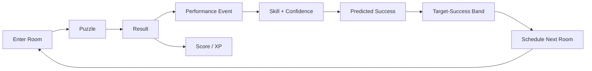
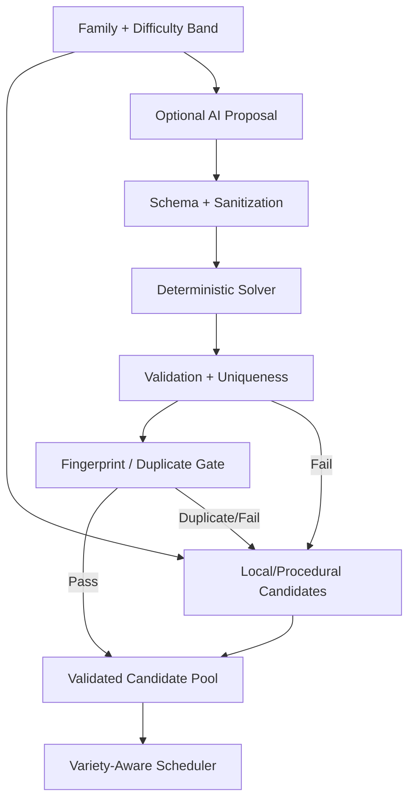
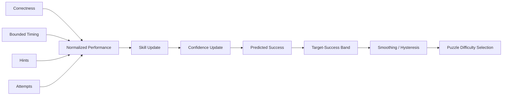
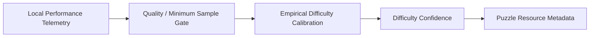
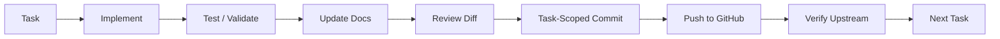

# MindForge Diagrams

## Gameplay Loop

```mermaid
flowchart LR
    ROOM[Enter Room] --> P[Puzzle]
    P --> R[Result]
    R --> PERF[Performance Event]
    PERF --> SKILL[Skill + Confidence]
    SKILL --> PRED[Predicted Success]
    PRED --> DIFF[Target-Success Band]
    DIFF --> NEXT[Schedule Next Room]
    R --> SCORE[Score / XP]
    NEXT --> ROOM
```

## Puzzle Source Selection

```mermaid
flowchart TD
    TARGET[Family + Difficulty Band] --> LOCAL[Local/Procedural Candidates]
    TARGET --> AI[Optional AI Proposal]
    AI --> PARSE[Schema + Sanitization]
    PARSE --> SOLVE[Deterministic Solver]
    SOLVE --> V[Validation + Uniqueness]
    V --> FP[Fingerprint / Duplicate Gate]
    FP -->|Pass| POOL[Validated Candidate Pool]
    V -->|Fail| LOCAL
    FP -->|Duplicate/Fail| LOCAL
    LOCAL --> POOL
    POOL --> PICK[Variety-Aware Scheduler]
```

## Adaptive Difficulty

```mermaid
flowchart LR
    A[Correctness] --> PERF[Normalized Performance]
    B[Bounded Timing] --> PERF
    C[Hints] --> PERF
    D[Attempts] --> PERF
    PERF --> SKILL[Skill Update]
    SKILL --> CONF[Confidence Update]
    CONF --> PRED[Predicted Success]
    PRED --> BAND[Target-Success Band]
    BAND --> SMOOTH[Smoothing / Hysteresis]
    SMOOTH --> PICK[Puzzle Difficulty Selection]
```

## Difficulty Calibration

```mermaid
flowchart LR
    TEL[Local Performance Telemetry] --> FILTER[Quality / Minimum Sample Gate]
    FILTER --> CAL[Empirical Difficulty Calibration]
    CAL --> CONF[Difficulty Confidence]
    CONF --> RES[Puzzle Resource Metadata]
```

## Per-Task GitHub Workflow

```mermaid
flowchart LR
    T[Task] --> I[Implement]
    I --> TEST[Test / Validate]
    TEST --> DOCS[Update Docs]
    DOCS --> DIFF[Review Diff]
    DIFF --> COMMIT[Task-Scoped Commit]
    COMMIT --> PUSH[Push to GitHub]
    PUSH --> VERIFY[Verify Upstream]
    VERIFY --> NEXT[Next Task]
```
